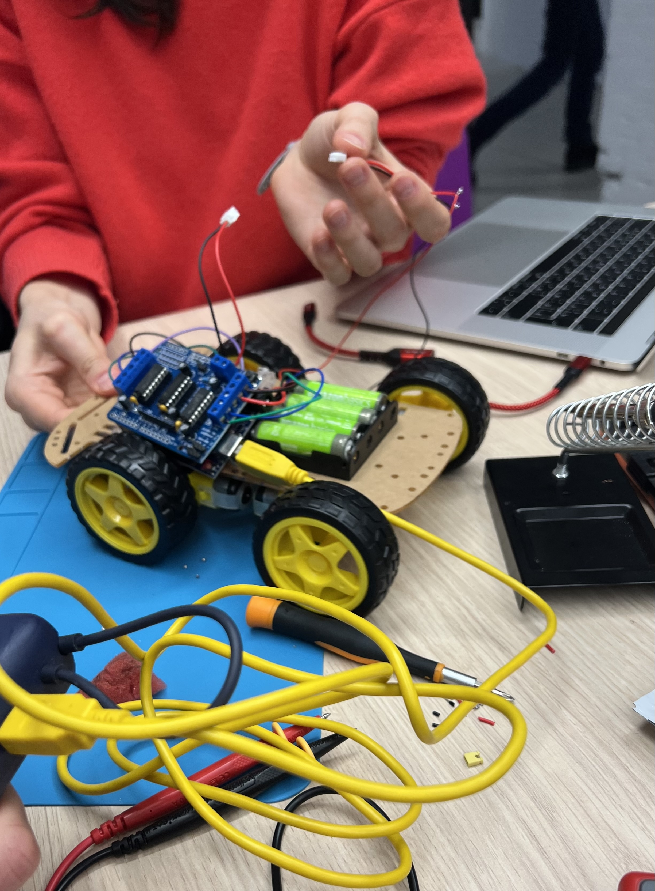

#  Electronics Club – Robot Car Project

##  Overview  
This project is part of our Electronics Club and focuses on building a **4-wheel obstacle avoiding robot car** using an Arduino.

##  Features  
- 4-wheel drive using gear motors  
- Obstacle detection with ultrasonic sensor  
- Motor control through L293D motor driver shield  
- Portable power using batteries  
- Expandable design for future features (Bluetooth, line following, etc.)

---

##  Materials  

- Arduino UNO R3  
- L293D motor drive shield  
- HC-SR04 ultrasonic sensor  
- 4 × gear motors  
- 4 × tire wheels (65 mm)  
- 4 × AA battery pack  
- 3.7V rechargeable battery  

### 📸 Current State of the Robot  

  

