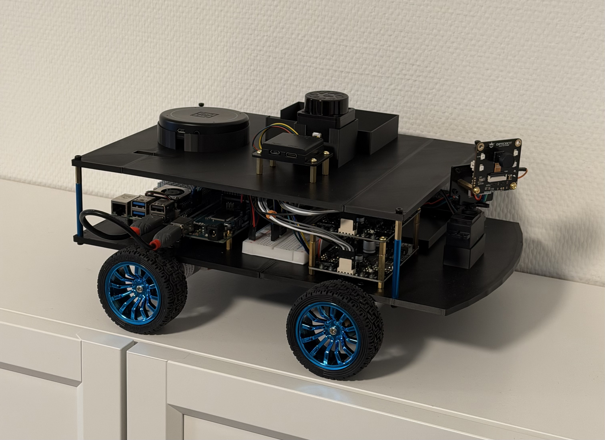

#  Robot Car Project

##  Overview  
Designing interactive robot car

##  Features  
- 4-wheel drive using gear motors  
- Autonomous and manual drive modes
- Obstacle detection using YDLIDAR
- Motor control via Arduino serial communication
- Voice control 
- Multithreaded LIDAR and Audio processing 

---

##  Materials  

